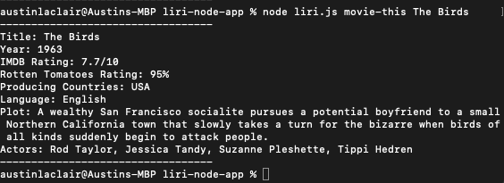
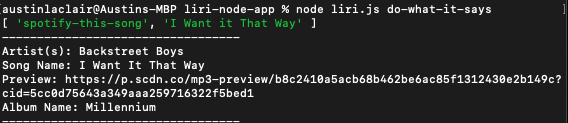
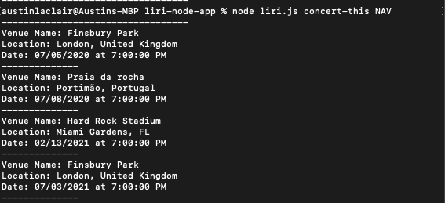
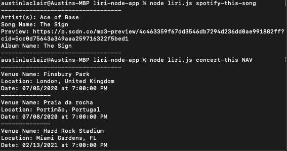

# liri-node-app
## What is LIRI Bot?
Liri Bot is like Siri, but much better. With LIRI, you can ask 4 commands: spotify-this-song <insert song>, concert-this <insert artist>,
movie-this <insert movie>, and do-what-it-says. More on each command in the Commands section
## Working Screenshots
                                   
 
## How to Use
First you will need to get a spotify for developers API key, which you can do .
After getting your spotify API key, you can plug those into a .env file. Then run npm i and install all dependencies and you are good to go!
## Commands
### concert-this
Type node liri.js into the terminal followed by concert-this and then an artist you would like to find upcoming concerts for.
### spotify-this-song
Type node liri.js into the terminal followed by spotify-this-song and then a song you would like to see more information on. If nothing is provided, default is The Sign by Ace of Base
### movie-this
Type node liri.js into the terminal followed by movie-this and then a movie would like to see more information on. If nothing is provided, default is Mr. Nobody
### do-what-it-says
After running node liri.js, it will read the random.txt file and do exactly what that file says. Change the information around and see what it does!

